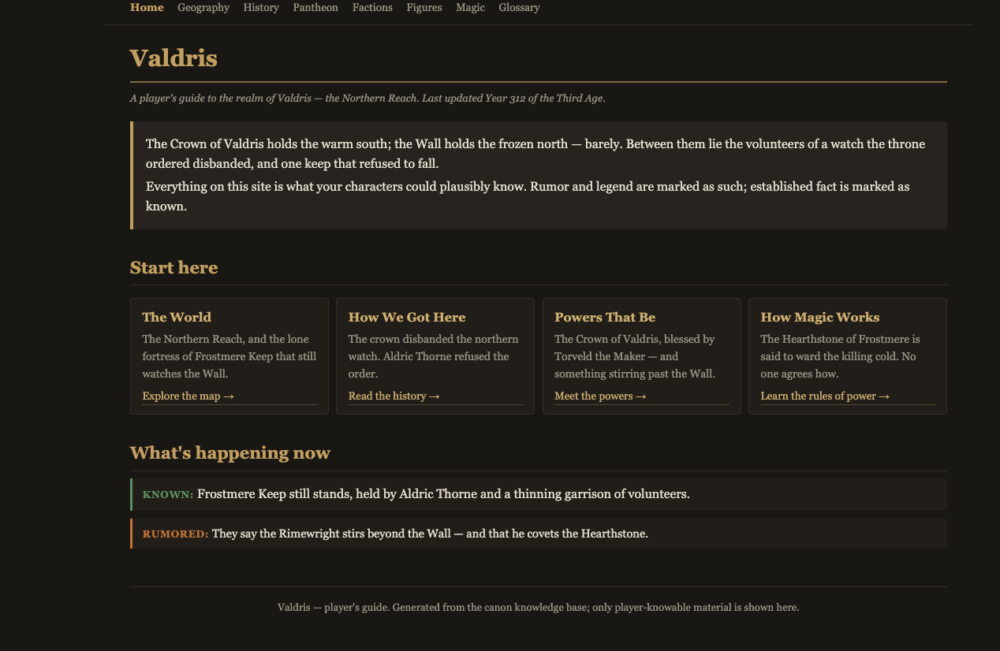

# Worldbuilding Knowledge Base — Template (Obsidian vault)

A reusable scaffold for turning a pile of campaign/world documents into a **persistent, navigable, source-cited knowledge base** — and from there into a **publishable world for player consumption**.

It is, quite literally, a relational database for a fictional world, built as an **[Obsidian](https://obsidian.md) vault**:

| Database concept | In this vault |
|---|---|
| Table row | a note in `entities/` (one per character, place, faction, god, item…) |
| Columns | that note's YAML frontmatter (`entity_type`, `status`, `aka`, `sources`…) |
| Foreign key | a `[[wikilink]]` to another note |
| SQL view | a **Dataview** query inside a domain MOC (`knowledge/CHARACTERS.md`, etc.) |
| ER diagram | Obsidian's graph view |
| Integrity constraints | the discipline rules in `CLAUDE.md` — *every fact cites a source, conflicts are flagged not guessed, one authority order decides every tie* — several now enforceable as live queries |

This template ships with **structure and rules but no world data.** You bring your own world.



*The built-in publishing layer turns your sourced canon into a player-facing guide like this — showing only what players are allowed to know (note the KNOWN vs. RUMORED markers), while GM secrets stay in the vault. The world above is throwaway demo content.*

## Who it's for

Game masters, worldbuilders, and authors who have a *lot* of scattered campaign material (PDFs, notes, spreadsheets, half-remembered rulings) and want a single, trustworthy, navigable canon they can grow without it contradicting itself — and eventually publish for players or readers. It works equally well for D&D, Pathfinder, any other system, or system-agnostic fiction.

## Everything here is free

The vault works with **[Obsidian](https://obsidian.md) (free)** plus the **Dataview (free)** community plugin. No paid plugins, no accounts, no servers, no private tools are required. (Obsidian Publish is mentioned later as one *optional* paid way to put a wiki online — the vault is fully functional without it.)

## Get this template

Three ways, pick one:

- **Use as a template (recommended):** on the GitHub page, click **“Use this template” → “Create a new repository.”** You get your own clean copy with no shared history.
- **Clone it:**
  ```bash
  git clone https://github.com/drjliddy-max/worldbuilding-kb-template.git my-world-kb
  ```
- **Download a ZIP:** GitHub page → green **“Code”** button → **“Download ZIP”**, then unzip.

Then follow [Quick start](#quick-start--30-minutes-to-a-working-skeleton) below.

---

## Why this exists

A campaign world lives across dozens of PDFs, spreadsheets, half-remembered rulings, and three slightly-contradictory versions of the same map. The problem isn't a lack of material — it's that nobody, human or AI, can answer "wait, is this character alive right now?" without re-reading everything and *still* getting it wrong because two docs disagree.

This system fixes that by making three promises:

1. **Every fact is traceable** to the document it came from.
2. **Contradictions are surfaced, never silently resolved** — you (the world's owner) make the call, once, and it propagates.
3. **There is a single authority order** so ties are never re-argued.

The payoff: a canon you can trust enough to hand to players, render as a wiki, or write a novel from.

### Where this shines (and where it's optional)

This template is at its strongest when you have a **large, messy, contradictory body of *existing* lore** — years of docs, multiple authors, renamed-three-times places, rulings that conflict — and you need to **reconcile it into one trustworthy canon**. That reconciliation problem is exactly what the source-citation and conflict-flagging discipline is built for, and it's what most "worldbuilding template" repos don't address at all.

If you're instead **starting a world from scratch**, you *are* the source of truth, so the heavy citation discipline is optional — lean on the structure (entities, links, dashboards, publishing) and dial the rigor up only as your canon grows and starts to contradict itself. The rules scale with you; they don't gate you on day one.

---

## What's in the box

| Path | What it is |
|---|---|
| `HOME.md` | **The master Map of Content.** Start here in Obsidian. Carries the live "discipline dashboards" (everything unverified, everything missing a source, all open conflicts) as Dataview queries. |
| `CLAUDE.md` | **The rules.** Canon-authority hierarchy, source-citation discipline, conflict-flagging, read-first mode, plus the Obsidian vault model. Doubles as instructions for an AI assistant (Claude Code / ChatGPT). **Read this first.** |
| `entities/` | **The rows.** One note per entity (`_TEMPLATE_ENTITY.md` to copy). Frontmatter = columns; `[[wikilinks]]` = relationships. |
| `knowledge/` | **The views.** One domain MOC per world-domain (characters, geography, magic…), each auto-listing its entities via Dataview. Includes `_TEMPLATE_DOMAIN.md` and `GLOSSARY.md` (the auto-built entity index + spelling authority). |
| `gaps.md` + `gaps/` | The open-conflicts / unanswered-questions ledger — one note per conflict (`gaps/_TEMPLATE_GAP.md`), dashboarded in `gaps.md`. The heart of the "never guess" rule. |
| `INDEX.md` | Catalog of every raw source file, topic-tagged, so you can find material fast. |
| `notes/ingestion-tracker/` | Read-pass logs — what you read, what it said, what contradicted. |
| `notes/canon/` | **The publishing layer.** A parchment-themed HTML + CSS template that renders your canon for players. |
| `handouts/` | Player-facing handout templates (briefs, item cards). |
| `external/` | Drop-zone for AI-assistant exports you want to ingest. |

---

## Quick start (≈ 30 minutes to a working skeleton)

> New to GitHub, Obsidian, or AI assistants? **[GETTING_STARTED.md](GETTING_STARTED.md)** is the hold-your-hand version — account signup through your first ingested source doc. The condensed steps below assume you're comfortable with the tools.

1. **Copy this whole folder** and rename it for your world (e.g. `aurelia-kb`).
2. **Open it as an Obsidian vault** ("Open folder as vault" → pick the folder) and install the **Dataview** community plugin (Settings → Community plugins → Browse → Dataview). Without Dataview the vault still works as plain Markdown — the query blocks just render as code instead of tables. Then open `HOME.md`.
3. **Fill in the placeholders.** In `CLAUDE.md` and `HOME.md` replace every `{{PLACEHOLDER}}`:
   - `{{WORLD_NAME}}`, `{{REGION}}`, `{{SYSTEM}}`, `{{OWNER}}`, `{{ORIGINAL_AUTHOR}}`, `{{SOURCE_ROOT}}`.
4. **Decide your authority order** — the single most important step. Fill in the table under *"Your canon-authority hierarchy"* in `CLAUDE.md`. Especially: name your **state-of-record document** (the one thing that wins on "who holds what / who's alive / what happened when").
5. **Point `{{SOURCE_ROOT}}` at your raw docs.** Keep the originals read-only; this KB *points to* them, it doesn't copy them.
6. **Trim `knowledge/`** to the domains your world actually has. Delete the MOCs you don't need; copy `knowledge/_TEMPLATE_DOMAIN.md` for anything new. Set each MOC's `domain:` field.
7. **Delete the example.** The vault ships with one worked example, `entities/_EXAMPLE_aldric-thorne.md`, so the Dataview dashboards render with content the moment you open the vault and you can see a filled-in entity. Once you've looked at it, delete it — it's clearly marked and not part of your world. (The `_TEMPLATE_*` files are the blanks to copy; keep those.)
8. **Start ingesting**, one source at a time, following the loop in `CLAUDE.md` → *"How to Ingest a New Source File."* For each entity you encounter, copy `entities/_TEMPLATE_ENTITY.md` to a new note, fill the frontmatter, cite every fact, link relationships with `[[wikilinks]]`, and file every conflict as a note in `gaps/`. Watch the dashboards in `HOME.md` fill in.

> **The first rule of using this template:** it is better to have ten facts that each cite a source than a hundred that don't. Go slow. Correctness compounds; guesses metastasize.

---

## Using it with an AI assistant

`CLAUDE.md` is written so an AI assistant (Claude Code, or pasted into ChatGPT as a system brief) will follow the same discipline you would: read sources, cite them, flag conflicts instead of inventing, ask before resolving. If you use Claude Code, the file is picked up automatically. If you use another assistant, paste `CLAUDE.md` in at the start of a session as the ground rules.

The `external/` folder is the bridge: when an AI gives you a big lore dump, save it there, treat it as **provisional**, and verify it against a primary source before it earns a place in `knowledge/`.

---

## Publishing for players

When your canon is solid, render the player-facing parts as a small static site:

- `notes/canon/canon.css` — the shared parchment theme.
- `notes/canon/index.html` — the hub/landing page.
- `notes/canon/_TEMPLATE_page.html` — copy for each domain page you want to publish.

These are plain HTML + CSS — no build step, no dependencies. Open `index.html` in a browser, or drop the `notes/canon/` folder on any static host (GitHub Pages, Netlify, a thumb drive at the table). **Only publish what players should know** — keep GM secrets in `entities/` and hand-pick what graduates to the HTML layer.

**Alternative:** if you'd rather not hand-build HTML, **Obsidian Publish** (a paid Obsidian service) can publish selected notes from this vault directly as a website, preserving your `[[wikilinks]]` as a navigable wiki. Publish a curated, player-safe subset — never the whole vault, which contains GM secrets and open plot threads.

---

## The one-paragraph philosophy

A world is only as believable as it is consistent, and consistency at scale is a *data* problem, not a creativity problem. This template treats your world like a database with integrity constraints: sourced facts, surfaced conflicts, one authority order, a clean separation between the master canon and what players see. Keep the discipline and the world stays coherent no matter how big it grows — coherent enough to publish.

---

## License & contributing

- **License:** [MIT](LICENSE) — use it, copy it, modify it, build your world freely.
- **Contributing:** see [CONTRIBUTING.md](CONTRIBUTING.md). You don't need to contribute back to use the template; improvements to the scaffold itself are welcome.
